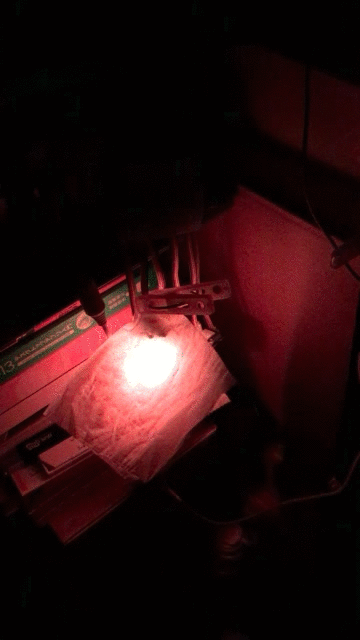

# RGB LED 一つでなるべく炎っぽく見せる python

炎いいよね…



画像だと妙に赤っぽいですが実際はそうでもないです。


## 材料

 - Raspberry Pi
 - GrovePi+
 - Chainable RGB LED x1
 - ちり紙一枚

ちり紙を RGB LED に軽く被せてください。


## Memo
```
nohup ~/bin/led_fire/led_fire.py > /dev/null 2>&1 &
```

## 今後

 - ドットマトリクス LED でやってみたい。
 - 自然音楽に合わせて色が変わるようにしたい。


## 免責・ライセンス

MIT


## 作者

tkumata
